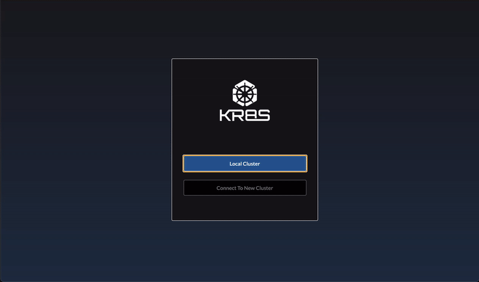
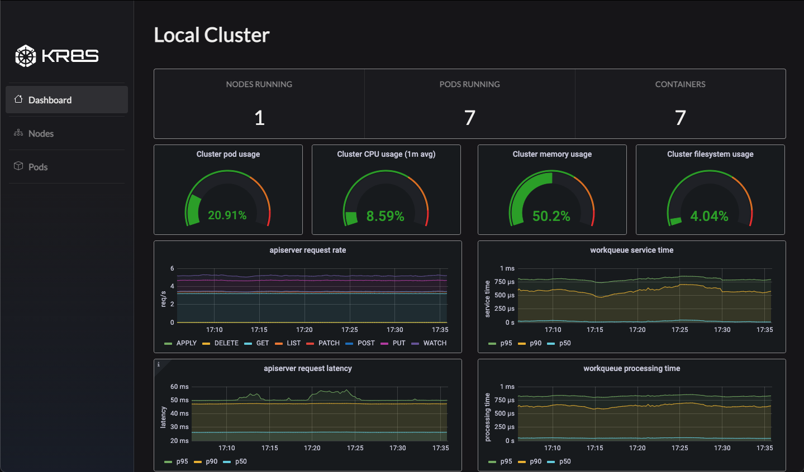
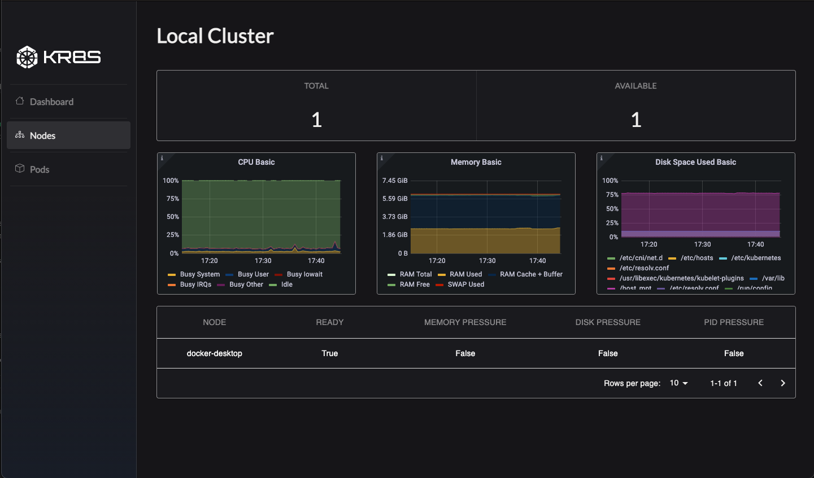
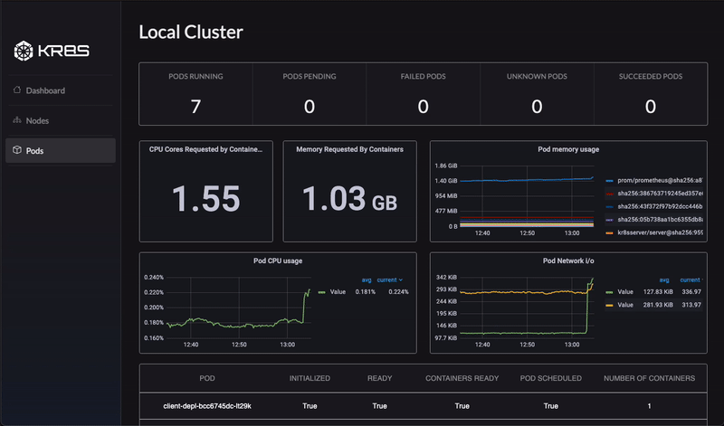

# Kr8s

## Table of Contents

- [Getting Started](#getting-started)
- [Features](#features)
- [Upcoming Features](#upcoming-features)
- [Meet Our Team](#meet-our-team)
   
   

## Summary

[Kr8s](https://kr8s.dev/) is a desktop application made for developers that need to monitor and visualize their Kubernetes clusters in a user friendly GUI. This easy-to-use tool will display the most important metrics for your cluster, nodes, pods, and containers. Kr8s seamlessly implements Prometheus and Grafana to give you everything you need in one integrated application.
 
 

# Getting Started

## Prerequisites

Kr8s functionality assumes that you have Docker and Kubernetes already installed and running on your machine. The simplest way to install both is to follow the instructions for [Docker Desktop](https://www.docker.com/get-started) installation, then enable Kubernetes from the Settings menu.
 
 

## Install Kr8s

TO DO
 
 

## I don't have an existing cluster but I want to demo Kr8s

If you are interested in trying out Kr8s, but do not yet have a running Kubernetes cluster, we created a rudimentary microservices application you can use to test features. Simply clone the [kr8sdemo repository](https://github.com/oslabs-beta/kr8sdemo) and follow the instruction in the README.

 
 

## Open App and Connect to Cluster

The app opens to the connect page. Select “Local Cluster” to connect to your local Kubernetes context (make sure Kubernetes is running). During start up Kr8s will deploy its pre-configured monitoring services to your cluster automatically. Prometheus and Grafana instances will be created or re-configured if they already exist. After a successful connection, you are redirected to the Dashboard page where data immediately populates into the visualizers and refreshes on a 15 second interval.
 
 

 
 

# Features

## Dashboard

The Dashboard page is the first page you will see once you connect to your local cluster. This page will give you metrics of your cluster on a high-level including pod usage, CPU usage, and memory usage.
 
 

 

## Nodes

The Nodes page will give you everything you will need to know about the nodes in your cluster such as the names and health of each node.
 
 

 

## Pods

The Pods page will display the most important metrics you will need when monitoring all of your pods including pod CPU usage, memory usage, and the names and health of each pod. The Pod View page can be accessed when you click on a specific pod on the Pods page, displaying information specific to the selected pod and its containers.
 
 

 

 
 

# Upcoming Features

Kr8s is an open-source product in active development. Below are some features that the Kr8s team plans to implement in upcoming versions.

- Support for multiple cluster connections
- Cloud service integration
- Custom visualizer creation
- Cluster object management and deployment

The team is always open to feedback and collaborators, so If you are interested in contributing to Kr8s please refer to [CONTRIBUTING.md](https://github.com/oslabs-beta/kr8s/blob/dev/CONTRIBUTING.md) for submission guidelines!  
 
 

# Meet Our Team

Adam Sheff  
[LinkedIn](https://www.linkedin.com/in/adam-sheff/) | [Github](https://github.com/adamISheff)

Duke Lee  
[LinkedIn](https://www.linkedin.com/in/duke-lee) | [Github](https://github.com/dukelee11)

Justin Stoddard  
[LinkedIn](https://www.linkedin.com/in/jgstoddard/) | [Github](https://github.com/jgstoddard)

Reland Boyle  
[LinkedIn](https://www.linkedin.com/in/relandboyle/) | [Github](https://github.com/GlorifiedBicycle)
